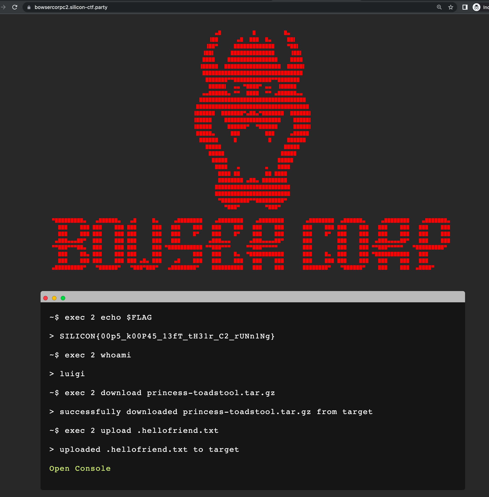
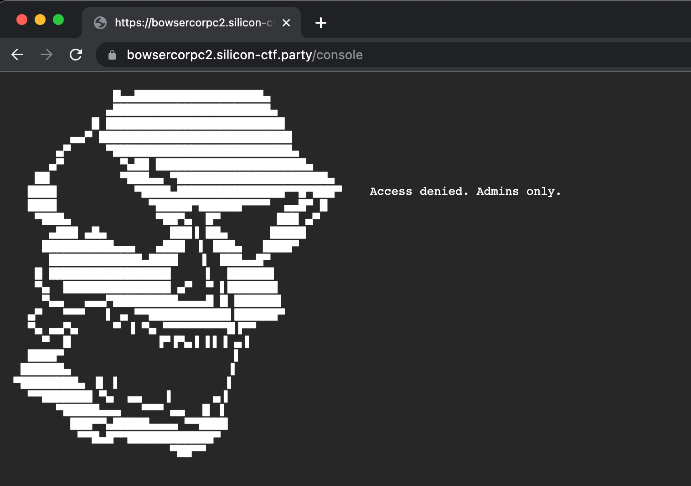
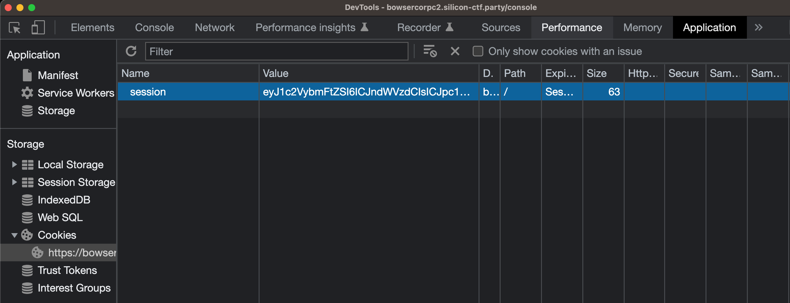
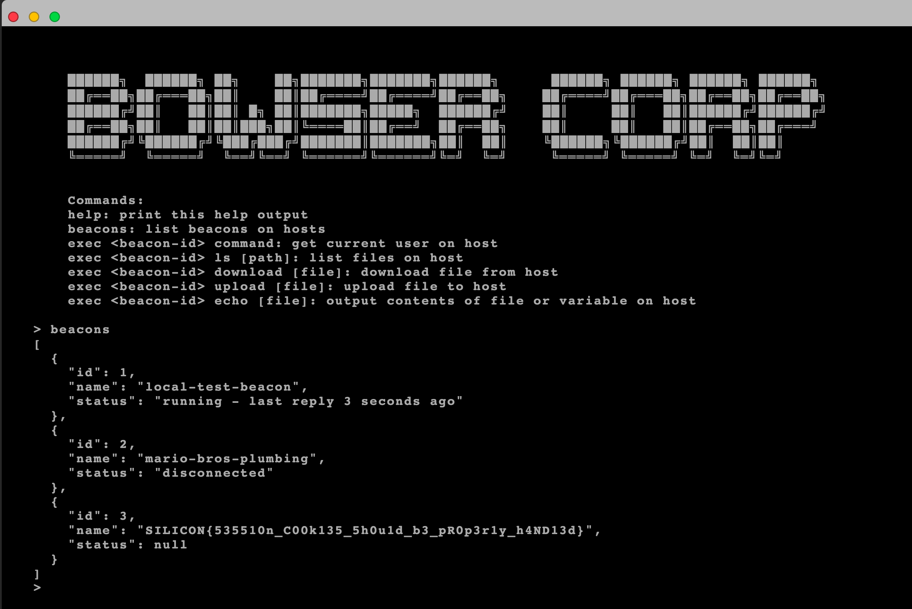
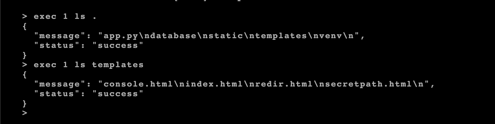
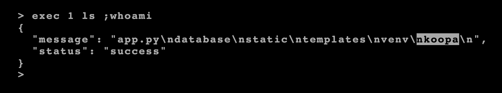
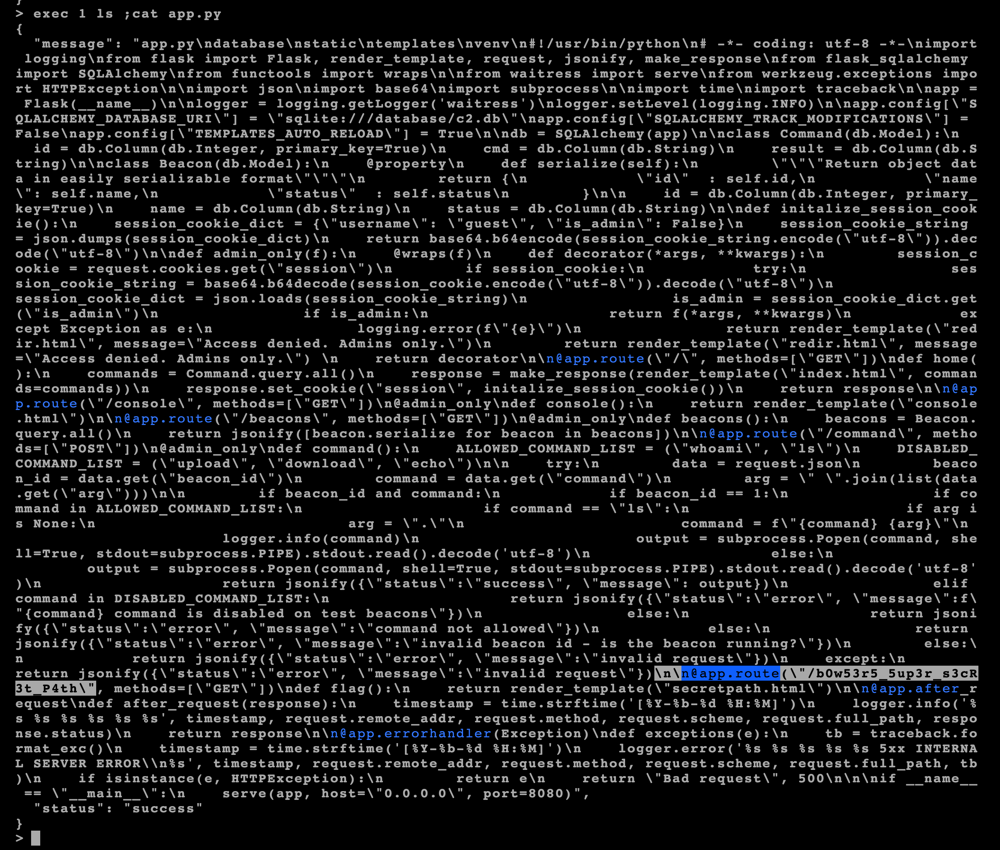
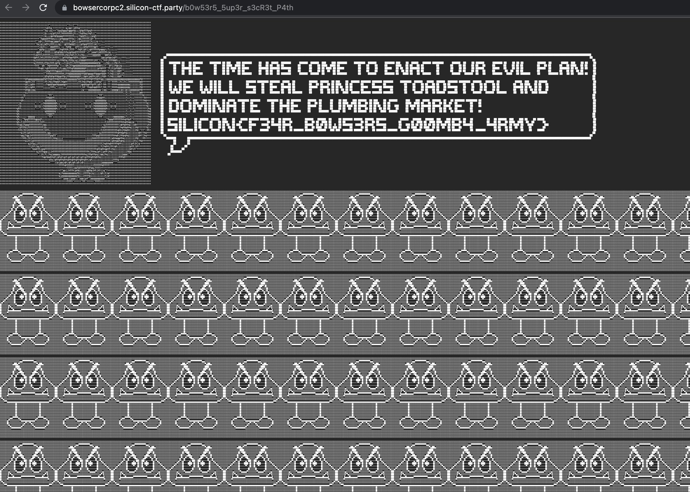

# Objective 1
When you log onto the web server, check the /tmp directory for hidden files
`ls -la /tmp`

You'll find .hellofriend.txt. `cat /tmp/.hellofriend.txt` and you will find the flag `SILICON{411_y0Ur_53v3R5_4r3_b3L0ng_t0_U5}`

Attackers will commonly leverage the /tmp directory to place their files and payloads since it is usually writable by everyone on the system (777 permissions)

# Objective 2
We are told in the description that a foothold was gained via the web server so we need to analyze the logs.

Logs in linux are usually found in /var/log. Looking there, we find /var/log/httpd which is full of apache log files.

It would be a lot of work to look line by line so let's use some bash skill. 

One way is to look for the word SILICON `grep -i silicon /var/log/httpd/*`

Another way is if you look at the logs, most IPs are internal 192.168.*, so if you use some bash to find all uniq IPs  - `awk '{ print $1}' /var/log/httpd/apache*.log | sort -r | uniq`. You will find one external IP `13.93.150.209`

Either way will lead you to this line `13.93.150.209 - - [04/May/2022:22:26:51 +0000] "GET /blue-shell.php HTTP/1.1" 200 75192 "https://bowsercorpc2.silicon-ctf.party" "Mozilla/5.0 (Windows NT 6.1; WOW64; Trident/7.0; rv:11.0) like Gecko"`

Going to that site `https://bowsercorpc2.silicon-ctf.party`, you find the flag `SILICON{00p5_k00P45_13fT_tH31r_C2_rUNn1Ng}`

# Objective 3
The home page of the site has a "Open Console" link that links to https://bowsercorpc2.silicon-ctf.party/console

But clicking it we get met with an Access Denied page with the message `Access denied. Admins only.`

A common way websites track the permissions/state of users is via cookies, so let's open our Chrome browser dev tools, and go to Application > Cookies > https://bowsercorpc2.silicon-ctf.party. We see there is a `session` cookie with that value `eyJ1c2VybmFtZSI6ICJndWVzdCIsICJpc19hZG1pbiI6IGZhbHNlfQ==`

This looks like a base64 encoded string. If you try to decode it (`echo 'eyJ1c2VybmFtZSI6ICJndWVzdCIsICJpc19hZG1pbiI6IGZhbHNlfQ==' | base64 -d`), you get back `{"username": "guest", "is_admin": false}`

We saw that the access denied page was saying admins only. What happens if we change our cookie to is_admin = true. 
First we change the json data and re-encode it to base64
`echo '{"username": "guest", "is_admin": true}' | base64`
Then we update the cookie via the browser dev tools `session=eyJ1c2VybmFtZSI6ICJndWVzdCIsICJpc19hZG1pbiI6IHRydWV9Cg==`

We navigate to https://bowsercorpc2.silicon-ctf.party/console again and we get through! We are met with what seems to be a command line interface. Testing out some of the commands offered, `beacons` leads to printing out our next flag `SILICON{535510n_C00k135_5h0u1d_b3_pR0p3r1y_h4ND13d}`

# Objective 4
Playing with some of the commands, we can see that the `exec 1 ls` command takes an option *path* argument and lists the files on the system. 

We can see using `exec 1 ls templates` there is a secretpath.html file but there's no command to read files as `download` is disabled on this beacon.

However, we can check to if the *path* argument is vulnerable to [command injection](https://book.hacktricks.xyz/pentesting-web/command-injection).

Using a semicolon to separate commands in bash, we can run `exec 1 ls ;whoami` and see that this site is vulnerable to command injection!

We can try to use `cat` to read the secretpath.html file but this seems to crash the terminal (the file is too big for the terminal to render). However, we can try reading `app.py` to see if the secretpath.html file is referenced.

We can see the secretpath file is rendered at the path https://bowsercorpc2.silicon-ctf.party/b0w53r5_5up3r_s3cR3t_P4th which gets our last flag.

`SILICON{F34R_B0W53R5_G00MB4_4RMY}`
