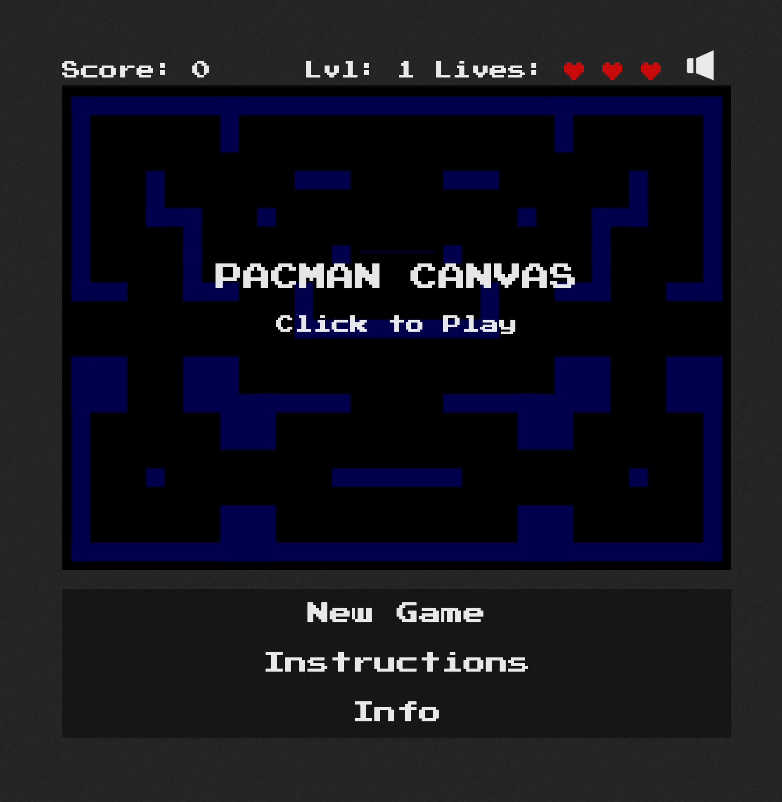
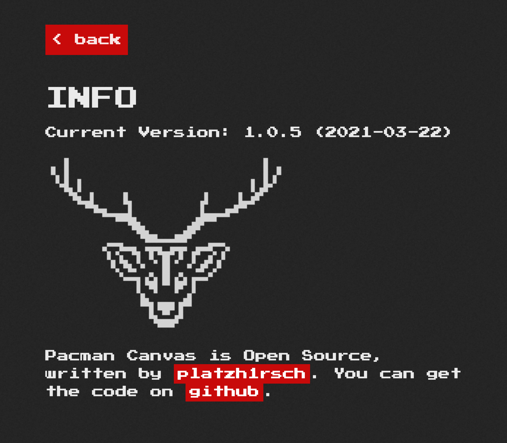
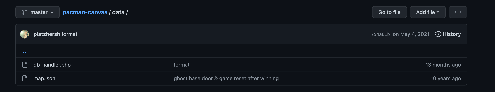
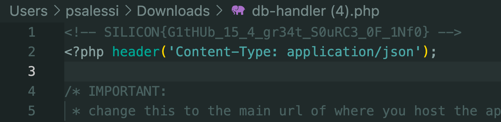
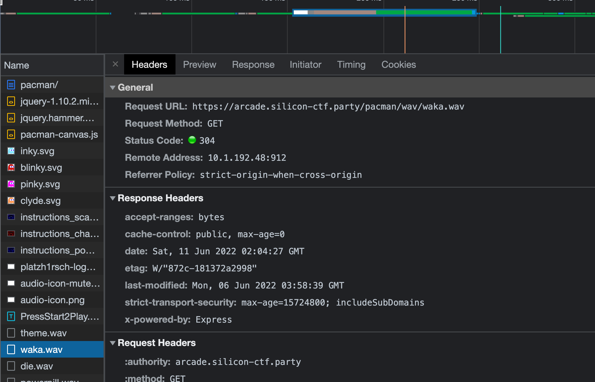
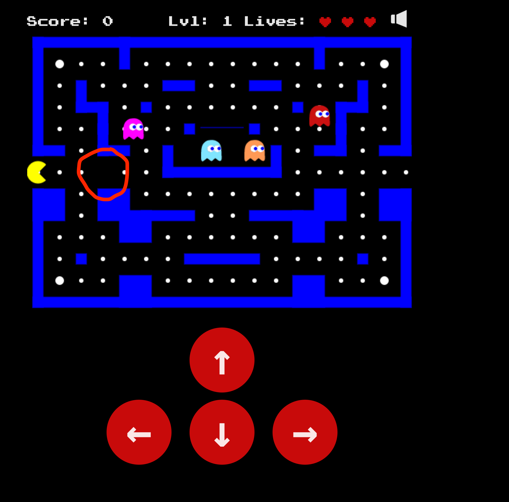
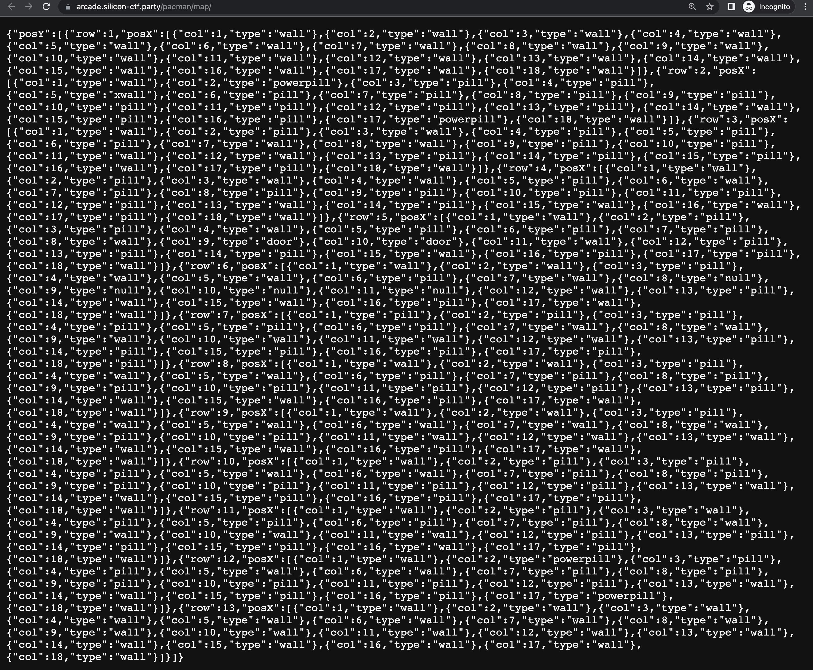
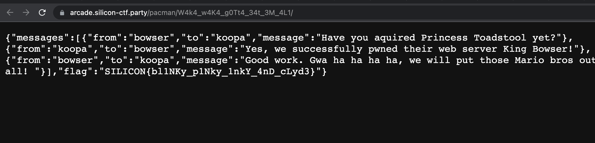

# Flag 1
The challenge description is `the source`. 

Going to the the [url](https://arcade.silicon-ctf.party/pacman/) leads us to a PacMan game in the browser.



Clicking the Info link brings us to page with two links, one of which links to the [GitHub](https://github.com/platzhersh/pacman-canvas) of the creator of the original PacMan game this challenge is based on.



Digging through this repo, there is a `data` directory with two files - `db-handler.php` & `map.json`.



We can go back to the challenge and see if either of these files exist on the web server. map.json exists but there's nothing interesting there. Checking for [db-handler.php](https://arcade.silicon-ctf.party/pacman/data/db-handler.php), we download a PHP file. 

Opening up this file reveals the flag at the top in an HTML comment.



`SILICON{G1tHUb_15_4_gr34t_S0uRC3_0F_1Nf0}`

# Flag 2
The challenge description is `_ floka flame`. 

This is a reference to [Waka Flocka Flame](https://en.wikipedia.org/wiki/Waka_Flocka_Flame). This is also the sound PacMan is known for making `waka waka waka`.

Opening the Chrome dev tools, going to the challenge page, and viewing the files loaded in the Network tab, we can see a waka.wav file.



We can download that file and see if there's any data hidden in it. This is a steganopgraphy challenge with the flag hidden in the wav file.

Using a tool like [WavSteg](https://github.com/ragibson/Steganography/blob/master/stego_lsb/WavSteg.py), we can try to extract the flag out of the file.
`stegolsb wavsteg -r -i waka.wav -o flag.txt -n 1 -b 100`

This works and we have our flag.
`SILICON{p4ck1nG_4ud10_W1Th_53cr3T5_15_3Z_pZ}`

# Flag 3 
The challenge text is `not everything is as it seems`. You can find a Python script for solving this challenge [here](./flag3-solver/)

Playing the PacMan game enough, we notice that there are some empty black spaces on the board. Every time we refresh the game, the empty black box moves. And after refreshing enough times, we can notice a repeating pattern.



Pulling open the Chrome dev tools, we can view the Network traffic when the page loads. We can see a call is made to the /map/ endpoint. Going to that endpoint reveals a JSON object that appears to define the maze for the game.



Refreshing this page, we notice the data change slightly, and upon closer inspection we find there is one element with the type `xwall` that changes and follows a pattern.

If we track the pattern and write down the posX and posY number for each occurence, we get a list like this.
```
posY:4, posX:7
posY:8, posX:7
posY:5, posX:2
posY:10, posX:7
posY:5, posX:2
posY:9, posX:5
posY:11, posX:9
posY:5, posX:2
posY:7, posX:5
posY:5, posX:2
posY:9, posX:5
posY:10, posX:3
posY:4, posX:8
posY:8, posX:4
posY:11, posX:6
posY:5, posX:2
posY:9, posX:5
posY:5, posX:1
posY:5, posX:2
posY:11, posX:6
posY:9, posX:5
posY:5, posX:1
posY:7, posX:7
posY:9, posX:5
posY:5, posX:2
posY:7, posX:6
posY:4, posX:9
posY:4, posX:7
```

Appending the posY and posX together, we can try to covert the numbers to [ASCII](https://www.asciitable.com/) which gives us the string `/W4k4_w4K4_g0Tt4_34t_3M_4L1`

This looks like a path! Navigating to [https://arcade.silicon-ctf.party/pacman/W4k4_w4K4_g0Tt4_34t_3M_4L1](https://arcade.silicon-ctf.party/pacman/W4k4_w4K4_g0Tt4_34t_3M_4L1), we find the flag!



`SILICON{bl1NKy_p1Nky_1nkY_4nD_cLyd3}`